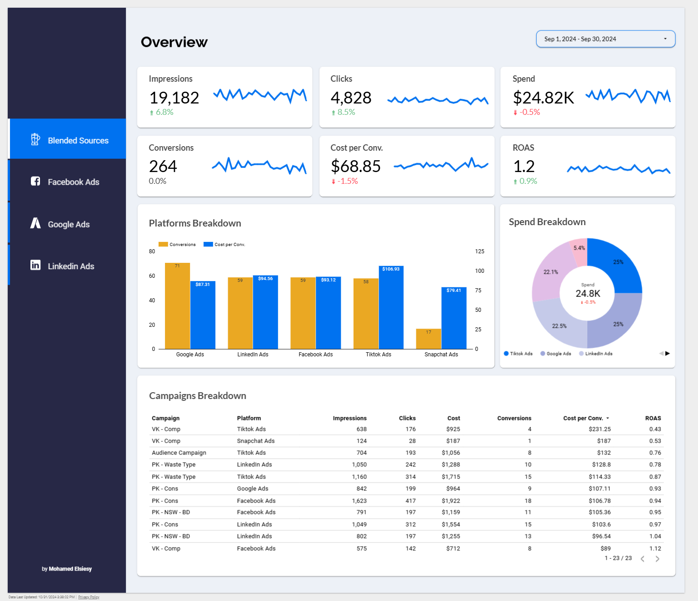

# Multi-Channel Ad Performance Data Pipeline

## Project Overview

This project establishes a robust and scalable data pipeline for multi-channel ad performance analytics. The pipeline ingests data from various advertising platforms (e.g., Facebook, Google, LinkedIn), processes and transforms it in Google BigQuery, and visualizes insights through Looker Studio. Core components include Fivetran for data ingestion, dbt for data transformation, and Apache Airflow for orchestration, all orchestrated within Google Cloud Platform (GCP).

### Key Components

- **Data Ingestion**: Fivetran continuously extracts ad data from platforms like Facebook, Google, and LinkedIn, loading it into the BigQuery landing area.
- **Data Transformation**: dbt (Data Build Tool) runs transformation workflows on Cloud Run, building a clean data model in BigQuery for accurate reporting.
- **Data Orchestration**: Apache Airflow, via Cloud Composer, orchestrates the entire pipeline, ensuring scheduled and event-based workflows.
- **Business Intelligence**: Processed data is visualized in Looker Studio, enabling insights into KPIs like impressions, clicks, conversions, and ROAS (Return on Ad Spend).

---

## Architecture Diagram

### **Pipeline Workflow**
     
   This diagram showcases the flow from data ingestion to transformation and visualization.

### **dbt on Cloud Run in Production**
     
   dbt models are executed as Cloud Run jobs, orchestrated by Cloud Composer, allowing for flexible scaling and efficient management of transformations in production.

   **References**: Deploying dbt on Cloud Run was inspired by [Richard He](https://www.youtube.com/@practicalgcp2780) and his practical insights on Google Cloud Platform.

### **Looker Studio Reports**
   - **Multi-Channel Report**: [View on Looker Studio](https://lookerstudio.google.com/reporting/a5e71242-3952-4c30-a2c5-e1d8ee3eac29)
   - **Facebook Ads Report**
   - **Google Ads Report**
   - **LinkedIn Ads Report**
   
     

   This dashboard presents ad performance metrics across platforms and by campaign, allowing for granular insights into marketing ROI.

---

## Components & Tools

### Fivetran
- **Purpose**: Automates data ingestion from various ad platforms into BigQuery.
- **Setup**: Connects to advertising channels, performing regular data syncs.

### Google BigQuery
- **Purpose**: Serves as the central data warehouse.
- **Data Layers**:
  - **Landing Area**: Raw data from Fivetran.
  - **Staging Layer**: Initial transformations and standardizations.
  - **Intermediate Layer**: Joins and aggregations for further processing.
  - **Mart Layer**: Final, clean data ready for analysis.

### dbt (on Cloud Run)
- **Purpose**: Runs SQL-based transformations on data stored in BigQuery.
- **Implementation**: dbt jobs are triggered as Cloud Run jobs, managed through Cloud Composer for production scheduling.

### Apache Airflow (Cloud Composer)
- **Purpose**: Orchestrates the end-to-end pipeline from ingestion to transformation.
- **Implementation**: Manages dbt job scheduling, monitoring, and error handling.

### Looker Studio
- **Purpose**: Data visualization tool for end-user reporting and analysis.
- **Implementation**: Connects to BigQuery to visualize KPIs like impressions, clicks, CPA, and ROAS.

---

## Project Setup

1. **Fivetran Setup**:
   - Connect your Fivetran account to advertising platforms.
   - Configure sync frequency and monitor initial data loads.

2. **BigQuery Setup**:
   - Create datasets for staging, intermediate, and mart layers.
   - Grant permissions for Fivetran and dbt access.

3. **dbt Configuration**:
   - Adjust the `profiles.yml` file to define your BigQuery connection settings, including project ID, dataset, and authentication details. Ensure this file is correctly configured for secure access to BigQuery.
   - Configure `dbt_project.yml` with model paths, materialization settings, and other project-specific configurations.
   - For more information, refer to the [dbt README](dbt/README.md).

4. **dbt on Cloud Run**:
   - Deploy dbt models on Cloud Run.
   - Use Cloud Composer to orchestrate dbt job runs for daily or on-demand executions.
   - For more details, see the [dbt on Cloud Run README](cloudrun/README.md).

5. **Cloud Composer Setup**:
   - Define DAGs to control Fivetran ingestion and dbt transformations.
   - Set schedules and manage job dependencies.
   - For more information, refer to the [Cloud Composer README](airflow-dags/README.md).

6. **Looker Studio**:
   - Connect Looker Studio to BigQuery.
   - Configure dashboards for ad performance across platforms and campaigns.

---

## Key Metrics

- **Impressions**: Total number of times ads were displayed.
- **Clicks**: Number of clicks generated by the ads.
- **Conversions**: Number of converted events generated by the ads.
- **Cost Per Conv. (Cost Per Conversion)**: Cost per conversion.
- **ROAS**: Return on ad spend, calculated by dividing revenue generated by ad spend.
